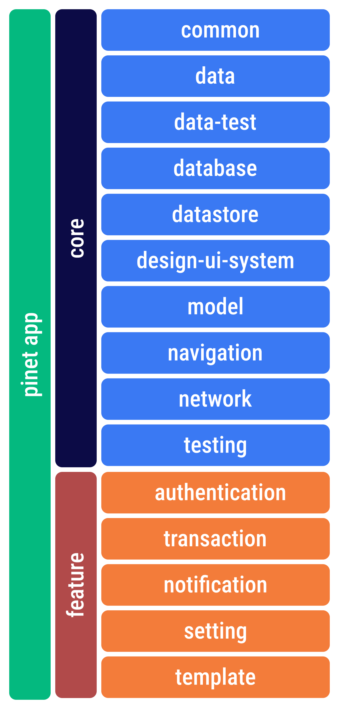
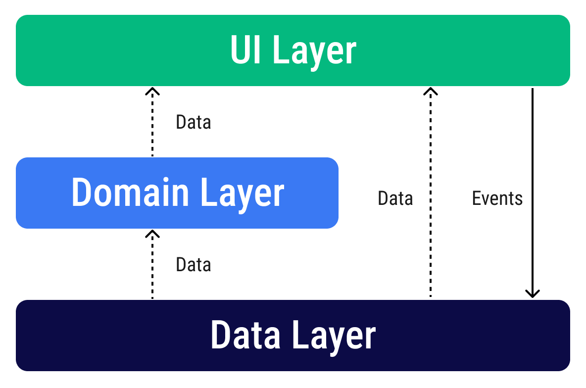

# PINET Mobile App

This is the repository for the PINET Mobile app. It is a work in progress 🚧.

## Architecture overview

### Modularization strategy

<left>

</left>

### Goals and requirement

- Easy for developers to understand, nothing too experimental.
- Support multiple developers working on the same codebase.
- Facilitate local and instrumented tests, both on the developer’s machine and using Continuous Integration (CI).
- Minimize build times.

The app architecture has three layers: a data layer, a domain layer and a UI layer.

The architecture follows a reactive programming model with [The United States of Flutter](https://gdg.community.dev/events/details/google-gdg-nuremberg-presents-united-states-of-flutter-unidirectional-data-flow-by-jeroen-meijer-remi-rousselet/). With the data layer at the bottom, the key concepts are:

- Higher layers react to changes in lower layers.
- Events flow down.
- Data flows up.

The data flow is achieved using streams, implemented using [Flutter Bloc](https://github.com/felangel/bloc/tree/master/packages/flutter_bloc).
